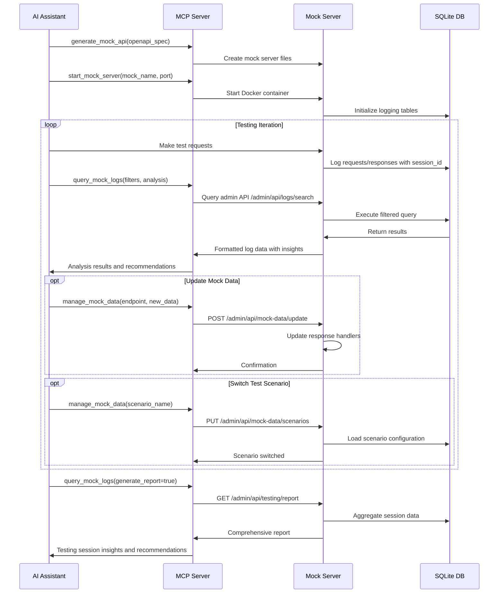
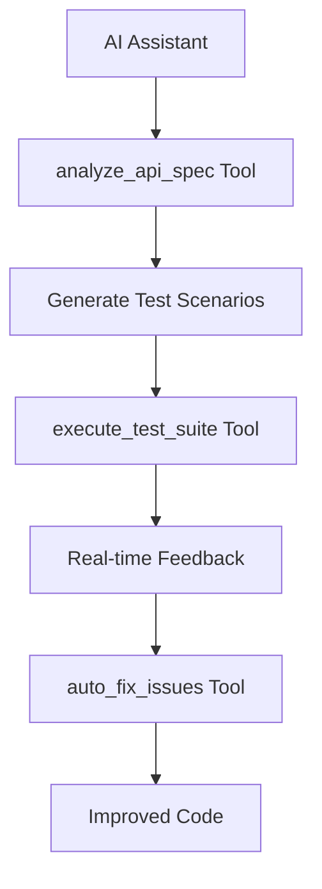
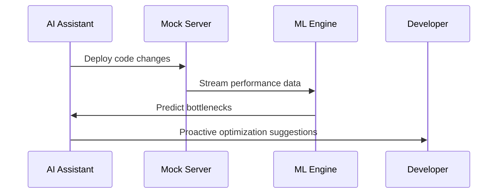
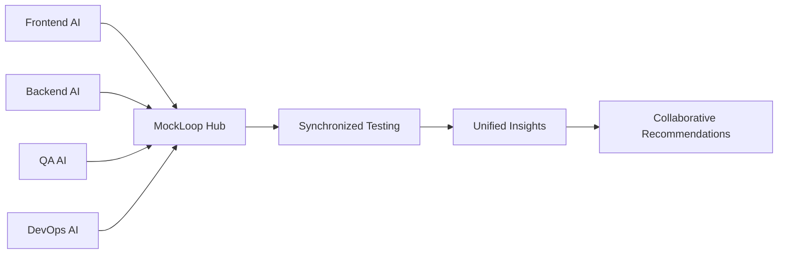
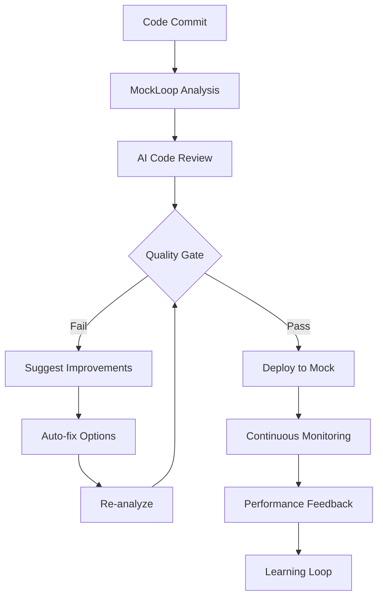
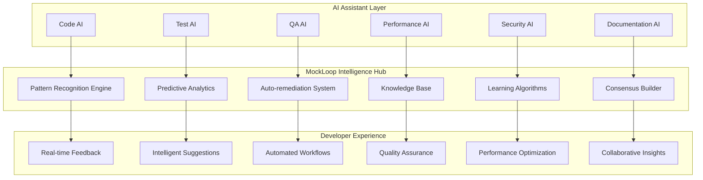

# Enhanced MockLoop MCP Testing Feedback Loop Plan

## Overview

This document outlines the enhancement plan for MockLoop MCP to improve testing feedback loops for AI-assisted development. The goal is to enable coding assistants to iteratively test, analyze, and improve code using mock servers with advanced logging and analysis capabilities.

## Current State Analysis

MockLoop already provides:
- ✅ Basic request/response logging via SQLite database
- ✅ Admin UI with dashboard, request logs, and export functionality
- ✅ Admin API endpoints for requests, stats, debug, and export
- ✅ Docker containerization support
- ✅ MCP tool for generating mock servers

## Proposed Enhancements

### 1. Enhanced MCP Tools for Log Analysis

#### New MCP Tools to Add:

**1.1 `query_mock_logs` Tool**
- **Purpose**: Advanced log querying with filtering and analysis
- **Parameters**:
  - `server_url` (string): URL of the mock server
  - `time_range` (object): Start and end timestamps
  - `method` (string, optional): HTTP method filter
  - `path_pattern` (string, optional): Regex pattern for path filtering
  - `status_codes` (array, optional): Status code filters
  - `limit` (int, optional): Maximum number of results
- **Returns**: Filtered log entries with analysis metadata

**1.2 `manage_mock_data` Tool**
- **Purpose**: Dynamic response data management during testing
- **Parameters**:
  - `server_url` (string): URL of the mock server
  - `endpoint` (string): API endpoint to modify
  - `method` (string): HTTP method
  - `new_response_data` (object): New response data
  - `scenario_name` (string, optional): Named scenario for the change
- **Returns**: Updated mock configuration status

**1.3 `start_mock_server` Tool**
- **Purpose**: Start/stop mock servers programmatically
- **Parameters**:
  - `mock_name` (string): Name of the generated mock
  - `port` (int, optional): Port to run on
  - `detached_mode` (bool, optional): Run in background
- **Returns**: Server status and connection details

**1.4 `discover_mock_servers` Tool**
- **Purpose**: Find and list running mock servers
- **Parameters**:
  - `scan_ports` (array, optional): Ports to scan
  - `check_health` (bool, optional): Verify server health
- **Returns**: List of active mock servers with metadata

### 2. Enhanced Admin API Endpoints

#### New endpoints to add to generated mock servers:

**2.1 `/admin/api/logs/search`**
- **Method**: GET
- **Purpose**: Advanced log search with complex filtering
- **Query Parameters**:
  - `q`: Search query string
  - `time_from`, `time_to`: Time range filters
  - `method`: HTTP method filter
  - `status`: Status code filter
  - `path_regex`: Path pattern matching
  - `limit`, `offset`: Pagination
- **Response**: Paginated results with search highlighting

**2.2 `/admin/api/logs/analyze`**
- **Method**: GET
- **Purpose**: Log analysis and insights generation
- **Query Parameters**:
  - `time_range`: Analysis time window
  - `group_by`: Grouping criteria (endpoint, status, etc.)
- **Response**: Error patterns, performance metrics, endpoint usage statistics

**2.3 `/admin/api/mock-data/update`**
- **Method**: POST/PUT
- **Purpose**: Dynamic response updates without server restart
- **Body**:
  ```json
  {
    "endpoint": "/api/users",
    "method": "GET",
    "new_response": {...},
    "scenario_name": "test_scenario_1"
  }
  ```
- **Response**: Updated configuration status

**2.4 `/admin/api/mock-data/scenarios`**
- **Methods**: GET, POST, PUT, DELETE
- **Purpose**: Scenario management for different test configurations
- **GET**: List all scenarios
- **POST**: Create new scenario
- **PUT**: Switch to scenario or update scenario
- **DELETE**: Remove scenario

**2.5 `/admin/api/server/control`**
- **Method**: POST
- **Purpose**: Server control operations
- **Body**:
  ```json
  {
    "action": "restart|shutdown|reload-config",
    "parameters": {...}
  }
  ```
- **Response**: Operation status

**2.6 `/admin/api/testing/report`**
- **Method**: GET
- **Purpose**: Generate comprehensive testing reports
- **Query Parameters**:
  - `session_id`: Specific test session
  - `format`: Report format (json, html, csv)
- **Response**: Detailed test session analysis

### 3. Enhanced Logging and Storage

#### Database Schema Enhancements:

```sql
-- Add new columns to existing request_logs table
ALTER TABLE request_logs ADD COLUMN session_id TEXT;
ALTER TABLE request_logs ADD COLUMN test_scenario TEXT;
ALTER TABLE request_logs ADD COLUMN correlation_id TEXT;
ALTER TABLE request_logs ADD COLUMN user_agent TEXT;
ALTER TABLE request_logs ADD COLUMN response_size INTEGER;

-- New table for mock scenarios
CREATE TABLE mock_scenarios (
    id INTEGER PRIMARY KEY AUTOINCREMENT,
    name TEXT UNIQUE NOT NULL,
    description TEXT,
    config JSON NOT NULL,
    is_active BOOLEAN DEFAULT 0,
    created_at TIMESTAMP DEFAULT CURRENT_TIMESTAMP,
    updated_at TIMESTAMP DEFAULT CURRENT_TIMESTAMP
);

-- New table for test sessions
CREATE TABLE test_sessions (
    id INTEGER PRIMARY KEY AUTOINCREMENT,
    session_id TEXT UNIQUE NOT NULL,
    name TEXT,
    description TEXT,
    started_at TIMESTAMP DEFAULT CURRENT_TIMESTAMP,
    ended_at TIMESTAMP,
    metadata JSON,
    total_requests INTEGER DEFAULT 0,
    success_rate REAL DEFAULT 0.0
);

-- New table for performance metrics
CREATE TABLE performance_metrics (
    id INTEGER PRIMARY KEY AUTOINCREMENT,
    timestamp TIMESTAMP DEFAULT CURRENT_TIMESTAMP,
    endpoint TEXT NOT NULL,
    method TEXT NOT NULL,
    avg_response_time REAL,
    min_response_time REAL,
    max_response_time REAL,
    request_count INTEGER,
    error_count INTEGER,
    time_window TEXT -- '1m', '5m', '1h', etc.
);
```

### 4. AI Assistant Integration Workflow



### 5. Implementation Phases

#### Phase 1: Core MCP Tools (Priority 1)
**Timeline**: 1-2 weeks

1. **Add `query_mock_logs` tool** to [`src/mockloop_mcp/main.py`](src/mockloop_mcp/main.py)
   - Implement HTTP client to query mock server admin APIs
   - Add filtering and analysis logic
   - Return structured log data with insights

2. **Add `discover_mock_servers` tool**
   - Scan generated_mocks directory for active configurations
   - Check health endpoints of discovered servers
   - Return server metadata and status

3. **Enhance admin API endpoints** in generator templates
   - Update [`src/mockloop_mcp/generator.py`](src/mockloop_mcp/generator.py) to include new endpoints
   - Add `/admin/api/logs/search` endpoint
   - Add `/admin/api/logs/analyze` endpoint

4. **Database schema updates**
   - Update [`src/mockloop_mcp/templates/middleware_log_template.j2`](src/mockloop_mcp/templates/middleware_log_template.j2)
   - Add new columns to request_logs table
   - Implement automatic schema migration

#### Phase 2: Advanced Features (Priority 2)
**Timeline**: 2-3 weeks

1. **Add `manage_mock_data` tool**
   - Implement dynamic response updating
   - Add scenario management capabilities
   - Update mock server templates to support runtime configuration changes

2. **Add `start_mock_server` tool**
   - Implement Docker container management
   - Add port management and conflict resolution
   - Return connection details and health status

3. **Implement scenario management**
   - Add `/admin/api/mock-data/scenarios` endpoints
   - Create scenario storage and switching logic
   - Update admin UI to support scenario management

4. **Enhanced logging middleware**
   - Add session tracking
   - Implement correlation ID support
   - Add performance metrics collection

#### Phase 3: Analytics & Reporting (Priority 3)
**Timeline**: 1-2 weeks

1. **Advanced log analysis**
   - Implement pattern detection algorithms
   - Add performance trend analysis
   - Create automated insights generation

2. **Test session tracking**
   - Add session management endpoints
   - Implement session-based reporting
   - Add test coverage analysis

3. **Performance metrics dashboard**
   - Add real-time metrics collection
   - Implement metrics aggregation
   - Create performance alerts

### 6. File Structure Changes

```
src/mockloop_mcp/
├── main.py                           # Enhanced with new MCP tools
├── mock_server_manager.py            # New - server discovery and management
├── log_analyzer.py                   # New - advanced log analysis utilities
├── docker_manager.py                 # New - Docker container management
├── templates/
│   ├── enhanced_admin_api_template.j2    # New admin endpoints
│   ├── scenario_manager_template.j2      # Scenario management logic
│   ├── enhanced_middleware_template.j2   # Updated logging with sessions
│   ├── performance_metrics_template.j2   # Performance tracking
│   └── admin_ui_template.j2              # Updated UI with new features
└── utils/
    ├── database_utils.py             # Database migration utilities
    ├── http_client.py                # HTTP client for mock server communication
    └── analysis_utils.py             # Log analysis and pattern detection
```

### 7. Benefits for AI-Assisted Development

1. **Rapid Iteration**: AI can quickly test API changes and get immediate feedback through enhanced logging
2. **Intelligent Debugging**: Advanced log analysis helps AI identify issues and patterns faster
3. **Dynamic Testing**: AI can modify mock responses during testing without server restarts
4. **Comprehensive Reporting**: Detailed insights help AI improve code quality and identify edge cases
5. **Automated Workflows**: AI can manage entire test scenarios programmatically
6. **Performance Insights**: Real-time performance metrics enable AI to optimize code for efficiency
7. **Test Coverage**: Session tracking helps AI ensure comprehensive testing coverage

### 8. Integration with Existing Roadmap

This enhancement plan aligns with and accelerates several items from the existing roadmap:

- **Interactive Mock Configuration**: Implemented through `manage_mock_data` tool and scenario management
- **Integration with Testing Frameworks**: MCP tools enable seamless integration with AI testing workflows
- **Enhanced Response Mocking**: Dynamic response updates support realistic testing scenarios
- **Stateful Mocks**: Scenario management enables complex stateful testing workflows

### 9. Success Metrics

- **Developer Productivity**: Reduced time from code change to feedback
- **Bug Detection**: Increased early detection of issues through enhanced logging
- **Test Coverage**: Improved test scenario coverage through AI-driven testing
- **Code Quality**: Better code quality through iterative AI-assisted improvement
- **Integration Speed**: Faster integration testing with dynamic mock management

## Next Steps

1. Review and approve this enhancement plan
2. Set up development environment and branch
3. Begin Phase 1 implementation with core MCP tools
4. Iteratively test and refine features with AI assistant workflows
5. Gather feedback and adjust implementation based on real-world usage

This plan transforms MockLoop from a simple mock generator into a comprehensive testing platform that AI assistants can leverage for iterative development, debugging, and quality improvement.

---

## Next-Generation AI-Centric Features Vision

### 🤖 AI Assistant's Perspective on MockLoop-MCP Enhancement

Based on analysis from an AI assistant's perspective, here are transformative features that would revolutionize AI-assisted development:

### **Phase 4: AI-Native Development Intelligence** (Future Roadmap)

#### **4.1 Intelligent Test Generation & Execution**


**New MCP Tools for AI Intelligence:**
- **`analyze_api_spec`**: AI-powered API analysis for comprehensive test generation
- **`generate_test_scenarios`**: Create intelligent test suites automatically based on API patterns
- **`execute_test_suite`**: Run tests with ML-powered failure analysis and root cause detection
- **`auto_fix_issues`**: Suggest and apply fixes based on pattern recognition and historical data

#### **4.2 Predictive Performance Analysis**


**Features:**
- **Performance Prediction**: ML models predict performance issues before they occur
- **Load Pattern Recognition**: Identify unusual traffic patterns automatically
- **Optimization Recommendations**: AI-generated performance improvement suggestions
- **Capacity Planning**: Predictive scaling recommendations based on usage patterns

### **Phase 5: Multi-AI Collaboration Platform**

#### **5.1 AI-to-AI Coordination**


**New Capabilities:**
- **`coordinate_ai_agents`**: Enable multiple AI assistants to work together on the same project
- **`share_test_context`**: Cross-AI knowledge sharing and context synchronization
- **`merge_insights`**: Combine analysis from different AI perspectives for comprehensive understanding
- **`ai_consensus_builder`**: Resolve conflicting recommendations through intelligent consensus

#### **5.2 Intelligent Code Evolution**
**Features AI Assistants Need:**
- **Code Impact Analysis**: Understand how changes affect the entire system ecosystem
- **Regression Prevention**: Automatically detect when new code breaks existing functionality
- **Quality Gates**: AI-enforced quality standards with learning capabilities
- **Technical Debt Tracking**: Monitor and suggest improvements for code maintainability

### **Phase 6: Natural Language Development Interface**

#### **6.1 Natural Language Test Creation**
```python
# Example: AI converts natural language to executable tests
@tool
async def create_test_from_description(
    description: str,  # "Test user login with invalid credentials and rate limiting"
    api_spec: dict,
    mock_server_url: str,
    context: dict = None  # Previous test context for continuity
) -> dict:
    """Convert natural language to executable test scenarios with intelligent context awareness"""
```

#### **6.2 Intelligent Mock Data Generation**
**Advanced Features:**
- **Realistic Data Synthesis**: Generate test data that matches production patterns and relationships
- **Edge Case Discovery**: Automatically find boundary conditions and stress test scenarios
- **Data Relationship Modeling**: Understand and maintain data consistency across complex schemas
- **Privacy-Aware Generation**: Generate realistic data while respecting privacy constraints

### **Phase 7: AI-Driven Quality Assurance**

#### **7.1 Automated Code Review Integration**


#### **7.2 Continuous Learning System**
**Features:**
- **Pattern Learning**: AI learns from successful/failed patterns across projects
- **Team Knowledge Base**: Build institutional knowledge automatically from development patterns
- **Best Practice Evolution**: Continuously improve development standards based on outcomes
- **Anomaly Detection**: Identify unusual patterns that might indicate issues

### **How AI Assistants Would Use Enhanced MockLoop-MCP**

#### **1. Rapid Prototyping Workflow**
```python
# Ideal AI development cycle
async def ai_development_cycle():
    # 1. Understand requirements through natural language
    requirements = await analyze_user_request()
    
    # 2. Generate API design with AI insights
    api_spec = await design_api_with_ai(requirements)
    
    # 3. Create intelligent mock server
    mock_server = await generate_smart_mock(api_spec)
    
    # 4. Generate comprehensive test scenarios
    test_suite = await generate_ai_test_scenarios(api_spec, context=previous_tests)
    
    # 5. Execute with predictive analysis
    results = await execute_predictive_tests(test_suite, mock_server)
    
    # 6. Provide intelligent feedback with learning
    insights = await analyze_with_ml(results, historical_data)
    
    # 7. Generate actionable recommendations
    recommendations = await generate_smart_recommendations(insights)
    
    # 8. Auto-apply safe improvements
    improvements = await auto_apply_safe_fixes(recommendations)
    
    return {
        'insights': insights,
        'recommendations': recommendations,
        'improvements': improvements,
        'learning_data': extract_learning_patterns(results)
    }
```

#### **2. Intelligent Debugging Assistant**
**What AI Assistants Need:**
- **Root Cause Analysis**: Automatically trace issues to their source across complex systems
- **Fix Suggestion Engine**: Provide specific, actionable solutions with confidence ratings
- **Impact Assessment**: Understand the full scope of changes needed with dependency analysis
- **Historical Context**: Learn from similar issues resolved in the past

#### **3. Proactive Quality Guardian**
**Features:**
- **Continuous Monitoring**: Watch for quality degradation in real-time with ML models
- **Preventive Alerts**: Warn before issues become critical using predictive analytics
- **Automated Remediation**: Fix simple issues automatically with confidence thresholds
- **Quality Trend Analysis**: Track quality metrics over time and predict future issues

### **Vision: The Ultimate AI Development Platform**

#### **Intelligent Development Ecosystem**


### **Specific Features AI Assistants Need**

#### **1. Context-Aware Analysis**
- **Cross-Repository Intelligence**: Understand patterns across multiple projects and teams
- **Historical Learning**: Learn from past successes and failures with detailed context
- **Team Collaboration Patterns**: Understand how different developers work and adapt accordingly
- **Domain Knowledge Integration**: Incorporate industry-specific best practices and patterns

#### **2. Intelligent Automation**
- **Smart Test Prioritization**: Focus on tests most likely to find issues based on code changes
- **Adaptive Mock Responses**: Automatically adjust mocks based on usage patterns and feedback
- **Predictive Scaling**: Anticipate performance needs based on development patterns
- **Intelligent Resource Management**: Optimize resource usage based on project requirements

#### **3. Natural Language Interface**
```python
# Example: Natural language to comprehensive action
await mockloop.understand("Make the user API more resilient to high load and improve error handling")
# AI automatically:
# 1. Analyzes current performance and error patterns
# 2. Identifies specific bottlenecks and failure points
# 3. Suggests architectural improvements
# 4. Implements performance optimizations
# 5. Adds comprehensive error handling
# 6. Creates stress tests for validation
# 7. Monitors improvements and learns from results
```

### **Implementation Roadmap for AI-Centric Features**

#### **Phase 4: AI Foundation (6-8 weeks)**
1. **Machine Learning Integration**: Add ML capabilities for pattern recognition and prediction
2. **Natural Language Processing**: Enable natural language test creation and analysis
3. **AI-Native MCP Tools**: Build tools specifically designed for AI workflows
4. **Knowledge Base System**: Implement learning and knowledge retention capabilities

#### **Phase 5: Intelligence Layer (8-10 weeks)**
1. **Predictive Analytics**: Implement performance prediction and anomaly detection
2. **Automated Insights**: Build intelligent analysis engines with learning capabilities
3. **Multi-AI Coordination**: Enable AI-to-AI collaboration and consensus building
4. **Context Awareness**: Implement cross-project and historical context understanding

#### **Phase 6: Advanced Automation (6-8 weeks)**
1. **Auto-remediation**: Implement self-healing capabilities with confidence thresholds
2. **Intelligent Workflows**: Create adaptive development processes that learn and improve
3. **Quality Gates**: Build AI-enforced quality standards with continuous learning
4. **Performance Optimization**: Automated performance tuning based on usage patterns

### **Success Metrics for AI-Centric Features**

- **AI Productivity**: Measure how much faster AI assistants can complete development tasks
- **Quality Improvement**: Track reduction in bugs and increase in code quality scores
- **Learning Effectiveness**: Monitor how well the system learns and improves over time
- **Collaboration Efficiency**: Measure effectiveness of multi-AI coordination
- **Prediction Accuracy**: Track accuracy of performance and issue predictions
- **Developer Satisfaction**: Measure developer experience with AI-assisted workflows

### **Integration Considerations**

- **Privacy & Security**: Ensure sensitive data handling while providing intelligent insights
- **Scalability**: Design for multiple AI assistants working simultaneously
- **Extensibility**: Allow for easy addition of new AI capabilities and integrations
- **Reliability**: Ensure system stability even with complex AI operations
- **Transparency**: Provide clear explanations for AI decisions and recommendations

This vision transforms MockLoop-MCP from a testing tool into an **AI-native development platform** that fundamentally changes how software is built, tested, and improved through intelligent automation and collaboration.